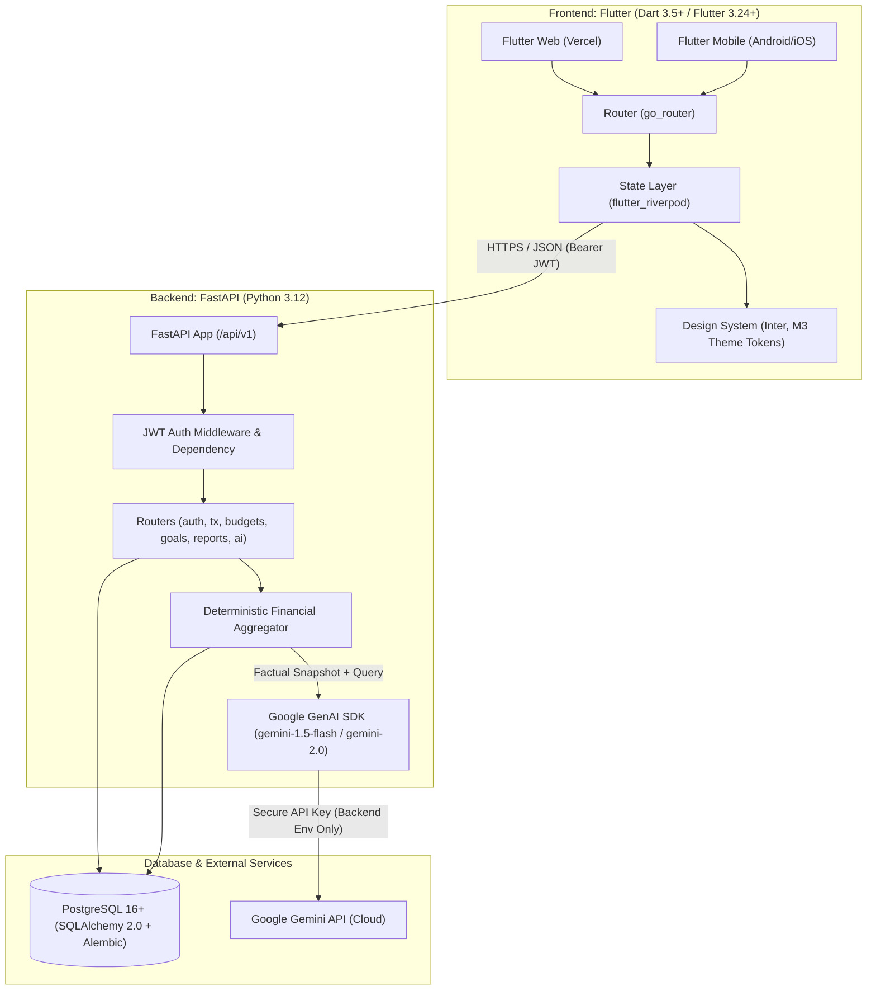
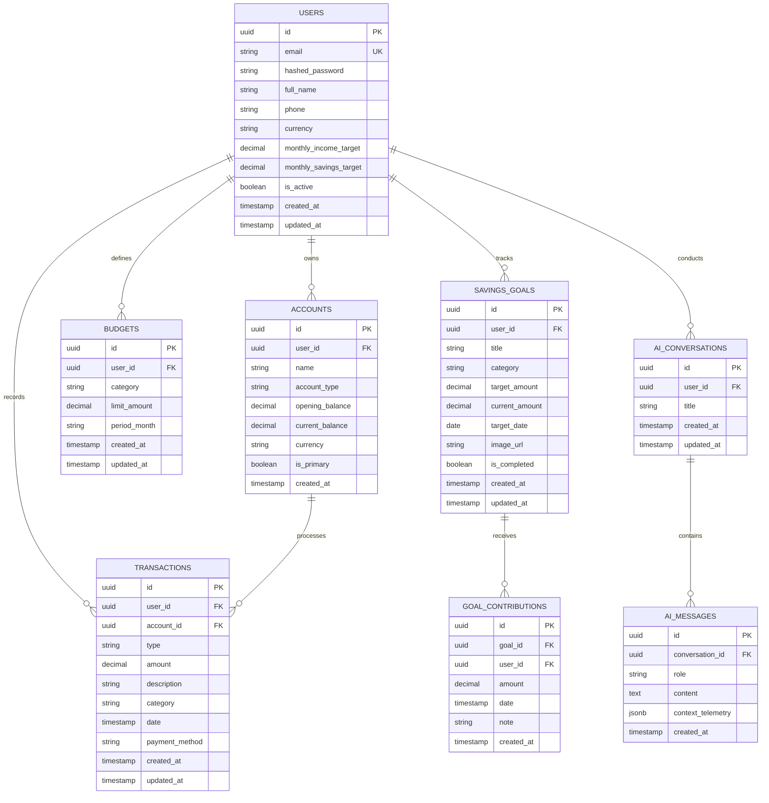
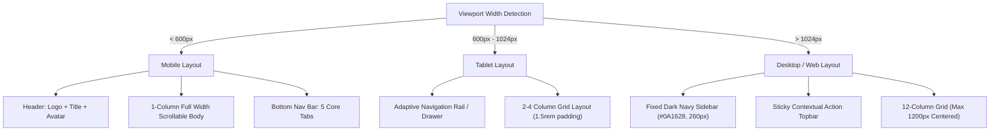
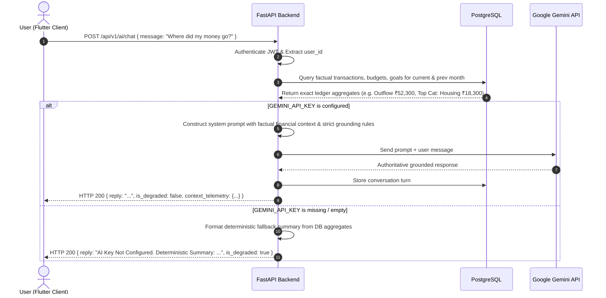

# Architectural Blueprint — Personal Finance AI

> **Status:** Final Architectural Specification (Phase 1)  
> **Source of Truth:** [PLAN.md](file:///home/hatch/workspace/personal-finance-ai/PLAN.md) & [DESIGN.md](file:///home/hatch/workspace/personal-finance-ai/designs/stitch_personal_finance_ai_app/personal_finance_ai/DESIGN.md)

---

## 1. System Overview

Personal Finance AI is an enterprise-grade personal wealth and money management platform designed specifically for the Indian market. The architecture is composed of a responsive client application, an asynchronous REST API backend, a relational database with strict per-user multi-tenancy, and an AI processing layer with deterministic financial grounding.



### System Stack Summary
- **Frontend:** Flutter + Dart (single codebase supporting Web, Android, iOS).
- **Backend:** Python FastAPI running with Uvicorn / AsyncIO.
- **Database:** PostgreSQL 16+ accessed via SQLAlchemy 2.0 async ORM and managed through Alembic database migrations.
- **AI Processing:** Google Gemini API accessed strictly via backend proxy; API keys are never exposed to clients.
- **Web Hosting:** Vercel (static Flutter web build with SPA rewrites).
- **Backend Hosting:** Render / Railway / Fly.io container service.

---

## 2. Module Breakdown

Per [PLAN.md](file:///home/hatch/workspace/personal-finance-ai/PLAN.md), the system is divided into 9 core modules:

| Module | Core Responsibilities | Key Components & Flow |
| :--- | :--- | :--- |
| **1. Auth** | User signup, login, session refresh, logout, password reset | JWT token generation (`access_token` & `refresh_token`), Argon2/Bcrypt password hashing, token validation dependency on all secure routes. |
| **2. Dashboard** | Financial command center & telemetry | Total net balance computed from tracked opening balances + cumulative transfers/cashflow (never conflated with net income - expense), monthly income/expense totals, net savings, savings rate (%), income vs expense velocity, category breakdown donut, recent transactions preview, budget health cards, active goal milestones, AI intelligence pulse. Supports Weekly / Monthly / Yearly / Custom filters. |
| **3. Transactions** | General ledger and cashbook entries | Full CRUD operations. Search by merchant/description/amount. Filters by category, date range, payment method (UPI, Debit Card, Credit Card, Net Banking, Cash). Sorting by date descending. Quick-entry collapsible drawer and modal sheet. |
| **4. Budgets** | Monthly category spending control | Monthly category budgets. Computes live spending by querying actual expense transactions within the current billing cycle. Calculates spent, remaining, and percentage utilized. Threshold triggers: Amber warning at $\ge 80\%$, Crimson alert at $\ge 100\%$. |
| **5. Savings Goals** | Milestone portfolio tracking | Target amount, target date, goal category, image representation, and linked contributions table. Computes saved sum, remaining gap, completion %, and AI projection date. |
| **6. AI Assistant** | Grounded financial co-pilot (`/ai/chat`) | Full chat interface with suggested quick prompts. The backend intercepts the user request, computes exact deterministic financial metrics from the database, injects the factual snapshot into Gemini's system context, and streams or returns an authoritative answer. Operates in graceful Degraded Mode when `GEMINI_API_KEY` is absent. |
| **7. Insights** | Telemetry and smart advisory engine | Deterministic engine calculates largest expense category, Month-over-Month (MoM) expenditure velocity, approaching budget limits, and savings rate gap. Combines factual findings with AI analytical summaries while strictly preserving the boundary between facts and advice. |
| **8. Reports** | Historical analytics & tax compliance | Monthly/Quarterly/Yearly income vs outflow charts, category spending distribution, Section 80C tax deduction progress (ELSS/EPF against ₹1,50,000 threshold), and CSV statement export. |
| **9. Settings** | Account & application preferences | User profile (PAN name, email, phone, KYC status), base currency selection (INR ₹ default), monthly income and savings targets, interface theme mode toggle, biometric authentication preference toggle, and account logout. |

---

## 3. API Contract Summary

All endpoints are prefixed with `/api/v1`.

### 3.1 Authentication Scheme
- **Mechanism:** HTTP Authorization header with Bearer JWT:
  ```http
  Authorization: Bearer <access_token>
  ```
- **Access Token:** Short-lived (60 minutes), signed with `HS256`, containing `{sub: user_id, email: user_email, exp: timestamp}`.
- **Refresh Token:** Long-lived (30 days), stored hashed in PostgreSQL to facilitate revocation on logout.
- **Authorization Enforcement:** Every protected route resolves current user via a FastAPI dependency `get_current_user`. All queries must filter by `user_id == current_user.id` to guarantee tenant isolation.

### 3.2 Endpoints Specification

#### Auth Endpoints
- `POST /api/v1/auth/signup`
  - **Request:** `{ "email": "rohan@example.com", "password": "SecurePassword123!", "full_name": "Rohan Sharma", "phone": "9876543210" }`
  - **Response (201):** `{ "user": { "id": "uuid", "email": "rohan@example.com", "full_name": "Rohan Sharma" }, "access_token": "...", "refresh_token": "...", "token_type": "bearer" }`
- `POST /api/v1/auth/login`
  - **Request:** `{ "email": "rohan@example.com", "password": "SecurePassword123!" }`
  - **Response (200):** Same as signup response.
- `POST /api/v1/auth/refresh`
  - **Request:** `{ "refresh_token": "..." }`
  - **Response (200):** `{ "access_token": "...", "refresh_token": "...", "token_type": "bearer" }`
- `POST /api/v1/auth/logout`
  - **Request:** `{ "refresh_token": "..." }`
  - **Response (200):** `{ "message": "Successfully logged out" }`
- `POST /api/v1/auth/password-reset`
  - **Request:** `{ "email": "rohan@example.com" }`
  - **Response (200):** `{ "message": "Password reset instructions sent if email exists" }`

#### User Profile Endpoints
- `GET /api/v1/users/me`
  - **Response (200):** User profile, currency, monthly targets, KYC status, preferences.
- `PATCH /api/v1/users/me`
  - **Request:** `{ "full_name": "...", "monthly_income_target": 100000.0, "monthly_savings_target": 35000.0, "preferences": { "biometric_enabled": true } }`
  - **Response (200):** Updated user profile.

#### Dashboard Endpoints
- `GET /api/v1/dashboard/summary?period=monthly&start_date=2025-03-01&end_date=2025-03-31`
  - **Response (200):**
    ```json
    {
      "total_balance": 245680.00,
      "primary_account": "HDFC Bank •• 4912",
      "period": "monthly",
      "monthly_in": 85000.00,
      "income_change_pct": 12.0,
      "monthly_out": 52300.00,
      "expense_budget_pct": 61.5,
      "net_savings": 32700.00,
      "savings_rate_pct": 38.4,
      "spending_by_category": [
        { "category": "Housing & Rent", "amount": 18300.00, "percentage": 35.0, "color": "#101c2e" },
        { "category": "Food & Dining", "amount": 12550.00, "percentage": 24.0, "color": "#006e2d" }
      ],
      "budget_health": {
        "total_budget": 85000.00,
        "spent": 52300.00,
        "status": "Healthy"
      },
      "recent_transactions": [ /* last 5 transactions */ ],
      "ai_pulse": {
        "title": "AI Intelligence Pulse",
        "message": "You spent ₹3,400 less on dining out this week. You are on track to preserve ₹12,000 extra in March.",
        "type": "positive"
      }
    }
    ```

#### Transactions Endpoints
- `GET /api/v1/transactions?skip=0&limit=50&category=Food%20%26%20Dining&type=expense&search=Swiggy&start_date=2025-03-01&end_date=2025-03-31&sort=date_desc`
  - **Response (200):** `{ "items": [ /* transaction objects */ ], "total": 124, "page": 1, "size": 50 }`
- `POST /api/v1/transactions`
  - **Request:**
    ```json
    {
      "account_id": "uuid",
      "type": "expense",
      "amount": 640.00,
      "description": "Swiggy Delivery",
      "category": "Food & Dining",
      "date": "2025-03-04T13:20:00Z",
      "payment_method": "UPI"
    }
    ```
  - **Response (201):** Created transaction object.
- `GET /api/v1/transactions/{id}` | `PUT /api/v1/transactions/{id}` | `DELETE /api/v1/transactions/{id}`

#### Budgets Endpoints
- `GET /api/v1/budgets?month=2025-03`
  - **Response (200):**
    ```json
    {
      "month": "2025-03",
      "total_budget": 85000.00,
      "total_spent": 52300.00,
      "items": [
        {
          "id": "uuid",
          "category": "Dining & Food",
          "limit_amount": 15000.00,
          "spent_amount": 12550.00,
          "remaining_amount": 2450.00,
          "percentage_used": 83.67,
          "is_warning": true,
          "is_exceeded": false
        }
      ]
    }
    ```
- `POST /api/v1/budgets`
  - **Request:** `{ "category": "Dining & Food", "limit_amount": 15000.00, "month": "2025-03" }`
  - **Response (201):** Budget item.
- `PUT /api/v1/budgets/{id}` | `DELETE /api/v1/budgets/{id}`

#### Savings Goals & Contributions
- `GET /api/v1/goals`
  - **Response (200):**
    ```json
    {
      "total_saved": 415000.00,
      "total_target": 800000.00,
      "active_goals_count": 3,
      "goals": [
        {
          "id": "uuid",
          "title": "Emergency Fund",
          "category": "Safety Net",
          "target_amount": 300000.00,
          "current_amount": 240000.00,
          "target_date": "2025-12-31",
          "progress_pct": 80.0,
          "status": "On schedule"
        }
      ]
    }
    ```
- `POST /api/v1/goals`
  - **Request:** `{ "title": "EV Car", "target_amount": 500000.00, "target_date": "2026-08-31", "category": "Vehicle" }`
  - **Response (201):** Created goal object.
- `POST /api/v1/goals/{id}/contributions`
  - **Request:** `{ "amount": 15000.00, "date": "2025-03-04T10:00:00Z", "note": "March salary allocation" }`
  - **Response (201):** Contribution record & updated goal total.
- `GET /api/v1/goals/{id}/contributions`

#### AI Assistant Endpoints
- `POST /api/v1/ai/chat`
  - **Request:** `{ "message": "Where did most of my money go this month?", "conversation_id": "optional-uuid" }`
  - **Response (200):**
    ```json
    {
      "conversation_id": "uuid",
      "reply": "Your top spending category in March is Housing & Rent at ₹18,300 (35%), followed by Food & Dining at ₹12,550 (24%). Together they represent 59% of your total outflows.",
      "is_degraded": false,
      "context_telemetry": {
        "monthly_out": 52300.00,
        "top_category": "Housing & Rent",
        "top_category_amount": 18300.00
      }
    }
    ```
  - When unconfigured (`GEMINI_API_KEY` unset):
    ```json
    {
      "conversation_id": "uuid",
      "reply": "AI Assistant is running in Degraded Telemetry Mode because GEMINI_API_KEY is not configured. Here is your deterministic March summary: Total Outflow: ₹52,300.00 across 34 transactions. Top Category: Housing & Rent (₹18,300.00). Net Savings: ₹32,700.00 (38.4% rate).",
      "is_degraded": true,
      "context_telemetry": { ... }
    }
    ```

#### Reports & Export Endpoints
- `GET /api/v1/reports/summary?timeframe=monthly&month=2025-03`
  - Returns income vs expense metrics, weekly velocity points, category distribution, and Section 80C tax tracker progress.
- `GET /api/v1/reports/export?format=csv&start_date=2025-03-01&end_date=2025-03-31`
  - Returns CSV file stream with headers: `Date,Type,Category,Description,Payment Method,Amount,Account`.

---

## 4. Data Model Summary (PostgreSQL + SQLAlchemy 2.0)



### Key Relational & Indexing Constraints
1. **Total Balance Integrity:** Defined as `SUM(accounts.opening_balance) + SUM(income) - SUM(expenses)` or dynamically tracked via `accounts.current_balance`. It is never approximated as a simple 30-day net calculation.
2. **Compound Indexes:**
   - `idx_transactions_user_date` on `transactions(user_id, date DESC)`
   - `idx_transactions_user_cat` on `transactions(user_id, category, date DESC)`
   - `idx_budgets_user_month_cat` on `budgets(user_id, period_month, category)` (UNIQUE)
   - `idx_contributions_goal` on `goal_contributions(goal_id, date DESC)`
3. **Decimal Precision:** All monetary fields utilize `DECIMAL(14, 2)` to eliminate floating-point rounding inaccuracies.

---

## 5. INR Currency Formatting Approach

1. **Symbol:** Indian Rupee glyph (`₹`, Unicode `U+20B9`), placed directly adjacent to the number without trailing whitespace (e.g., `₹1,24,500.00`).
2. **Numbering Format:** Strict Indian system (Lakhs and Crores):
   - First delimiter marks the hundreds place (3 digits from right).
   - All preceding delimiters group every 2 digits (thousands, lakhs, crores).
   - Examples:
     - `1,000` $\rightarrow$ `₹1,000`
     - `85,000` $\rightarrow$ `₹85,000`
     - `1,24,500` $\rightarrow$ `₹1,24,500.00`
     - `1,00,00,000` $\rightarrow$ `₹1,00,00,000.00` (1 Crore)
3. **Flutter Implementation Strategy:**
   - A dedicated formatter utility `InrFormatter` leveraging Dart's `intl` package configured with locale `en_IN` (`NumberFormat.currency(locale: 'en_IN', symbol: '₹')`).
   - Compact formatting for charts/chips: `₹52.3k`, `₹3.4 Cr`.
4. **Typographic Anti-Jitter:**
   - All numerical displays in ledger tables, balance cards, and budget gauges specify `FontFeature.tabularFigures()` (`tnum`). This prevents width variations during dynamic number animations.

---

## 6. Responsive Layout Strategy

The application layout adapts seamlessly across three screen size classes using a centralized `ResponsiveLayout` wrapper:



### Layout Specifications
- **Mobile (< 600px):**
  - Navigation: Fixed bottom navigation bar with 5 items: Home, Transactions, Budgets, Goals, AI Assistant.
  - Header: Sticky Navy header (`#101c2e`) with logo, title, and profile avatar.
  - Layout: 4 fluid columns, 16px (`1rem`) gutters, full-width cards.
- **Tablet (600px - 1024px):**
  - Navigation: Adaptive navigation rail or drawer.
  - Layout: 8 fluid columns, 24px (`1.5rem`) outer margins, 2-column or 4-column balanced metric cards.
- **Desktop / Web (> 1024px):**
  - Navigation: Persistent left dark navy sidebar (`#0A1628` background, `#FFFFFF` navigation text, active emerald accent `#16A34A`).
  - Topbar: Minimal elevated bar housing search, active date filters, notifications, and profile switch.
  - Canvas: Centered 12-column grid constrained to a maximum width of `1200px` with `2rem` margins.

---

## 7. AI Flow & Safeguards



### Key AI Safety Principles
1. **Zero Hallucination of Numbers:** The AI is strictly barred from computing financial aggregates. All sums, percentages, and deltas are calculated in Python/SQL and passed as ground truth.
2. **Graceful Degraded Mode:** If `GEMINI_API_KEY` is not present, the backend immediately returns a structured response with `is_degraded: true` and the deterministic calculation. It never invents responses or causes unhandled 500 errors.
3. **Key Isolation:** The Gemini API key resides solely in the backend environment. It is never shipped in Flutter source code, client config, or git.

---

## 8. Theme Tokens (Copied from Stitch `DESIGN.md`)

### 8.1 Exact YAML Configuration
```yaml
name: Personal Finance AI
colors:
  surface: '#f7f9fb'
  surface-dim: '#d8dadc'
  surface-bright: '#f7f9fb'
  surface-container-lowest: '#ffffff'
  surface-container-low: '#f2f4f6'
  surface-container: '#eceef0'
  surface-container-high: '#e6e8ea'
  surface-container-highest: '#e0e3e5'
  on-surface: '#191c1e'
  on-surface-variant: '#45474c'
  inverse-surface: '#2d3133'
  inverse-on-surface: '#eff1f3'
  outline: '#75777d'
  outline-variant: '#c5c6cd'
  surface-tint: '#535f74'
  primary: '#000000'
  on-primary: '#ffffff'
  primary-container: '#101c2e'
  on-primary-container: '#79849b'
  inverse-primary: '#bbc7df'
  secondary: '#006e2d'
  on-secondary: '#ffffff'
  secondary-container: '#7cf994'
  on-secondary-container: '#007230'
  tertiary: '#000000'
  on-tertiary: '#ffffff'
  tertiary-container: '#410002'
  on-tertiary-container: '#f63a35'
  error: '#ba1a1a'
  on-error: '#ffffff'
  error-container: '#ffdad6'
  on-error-container: '#93000a'
  primary-fixed: '#d7e3fc'
  primary-fixed-dim: '#bbc7df'
  on-primary-fixed: '#101c2e'
  on-primary-fixed-variant: '#3c475b'
  secondary-fixed: '#7ffc97'
  secondary-fixed-dim: '#62df7d'
  on-secondary-fixed: '#002109'
  on-secondary-fixed-variant: '#005320'
  tertiary-fixed: '#ffdad6'
  tertiary-fixed-dim: '#ffb4ab'
  on-tertiary-fixed: '#410002'
  on-tertiary-fixed-variant: '#93000b'
  background: '#f7f9fb'
  on-background: '#191c1e'
  surface-variant: '#e0e3e5'
typography:
  display-lg:
    fontFamily: Inter
    fontSize: 36px
    fontWeight: '700'
    lineHeight: 44px
    letterSpacing: -0.02em
  headline-lg:
    fontFamily: Inter
    fontSize: 30px
    fontWeight: '700'
    lineHeight: 38px
    letterSpacing: -0.02em
  headline-md:
    fontFamily: Inter
    fontSize: 24px
    fontWeight: '600'
    lineHeight: 32px
    letterSpacing: -0.015em
  headline-sm:
    fontFamily: Inter
    fontSize: 20px
    fontWeight: '600'
    lineHeight: 28px
    letterSpacing: -0.01em
  title-lg:
    fontFamily: Inter
    fontSize: 18px
    fontWeight: '600'
    lineHeight: 26px
    letterSpacing: -0.005em
  title-md:
    fontFamily: Inter
    fontSize: 16px
    fontWeight: '600'
    lineHeight: 24px
  body-lg:
    fontFamily: Inter
    fontSize: 16px
    fontWeight: '400'
    lineHeight: 24px
  body-md:
    fontFamily: Inter
    fontSize: 14px
    fontWeight: '400'
    lineHeight: 20px
  body-sm:
    fontFamily: Inter
    fontSize: 13px
    fontWeight: '400'
    lineHeight: 18px
  label-lg:
    fontFamily: Inter
    fontSize: 14px
    fontWeight: '500'
    lineHeight: 20px
  label-md:
    fontFamily: Inter
    fontSize: 12px
    fontWeight: '500'
    lineHeight: 16px
    letterSpacing: 0.02em
  label-sm:
    fontFamily: Inter
    fontSize: 11px
    fontWeight: '600'
    lineHeight: 14px
    letterSpacing: 0.04em
  metric-xl:
    fontFamily: Inter
    fontSize: 32px
    fontWeight: '700'
    lineHeight: 38px
    letterSpacing: -0.02em
  metric-lg:
    fontFamily: Inter
    fontSize: 24px
    fontWeight: '700'
    lineHeight: 30px
    letterSpacing: -0.01em
  metric-md:
    fontFamily: Inter
    fontSize: 18px
    fontWeight: '600'
    lineHeight: 24px
rounded:
  sm: 0.25rem       # 4px
  DEFAULT: 0.5rem   # 8px
  md: 0.75rem       # 12px
  lg: 1rem          # 16px
  xl: 1.5rem        # 24px
  full: 9999px
spacing:
  gutter: 1rem           # 16px
  gutter-sm: 0.75rem     # 12px
  margin: 1rem           # 16px
  margin-tablet: 1.5rem  # 24px
  margin-desktop: 2rem   # 32px
  space-xs: 0.25rem      # 4px
  space-sm: 0.5rem       # 8px
  space-md: 1rem         # 16px
  space-lg: 1.5rem       # 24px
  space-xl: 2rem         # 32px
```

### 8.2 Core Brand Palette Roles
- **Primary (`#0A1628` - Obsidian Navy / `#101C2E` - Container):** Structural chrome, navigation bars, headers, high-priority primary actions.
- **Secondary (`#16A34A` / `#006E2D` - Growth Emerald):** Income, savings yields, positive deltas, affirmative actions.
- **Tertiary / Debit (`#DC2626` / `#BA1A1A` - Debit Crimson):** Outflows, expense amounts, budget deficit warnings.
- **Alert / Notice (`#F59E0B` - Amber Alert):** Budget warning threshold ($\ge 80\%$), pending verifications, AI degraded notices.
- **Neutral Canvas (`#F8FAFC` - Slate Crisp / `#F7F9FB`):** Low-contrast glare-free base surface.
- **Card Surface (`#FFFFFF` - Pure White):** Elevated operational containers with `1px solid #E2E8F0` border and subtle shadow.
- **Text Primary (`#0F172A` / `#191C1E`):** Deep slate-charcoal for readable typography.
- **Text Secondary (`#64748B` / `#45474C`):** Subtitles, timestamps, and secondary table columns.

---

## 9. Implementation Roadmap & Boundaries

- **Phase 1 (Current):** System architecture, directory scaffold, `.gitignore`, `README.md`, and design token mapping. No feature code.
- **Phase 2:** Flutter shell, design tokens, typography, responsive framework, and auth screens.
- **Phase 3:** Backend setup, PostgreSQL schema, migrations, JWT authentication, and user-scoped endpoints.
- **Phase 4:** Core financial features (transactions, budgets, goals, dashboard, reports, CSV export).
- **Phase 5:** AI assistant endpoint, context gathering, and Gemini integration with degraded fallback.
- **Phase 6:** Testing, linting, build verification (`flutter build web`, pytest).
- **Phase 7:** Deployment documentation, Vercel web hosting, backend deployment.
